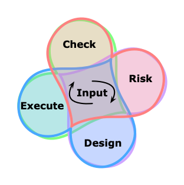

# Edification

## Knowledge, Aesthetic, and Development

* <b>[Nevermind](Nevermind.pdf)</b> life management
* <b>[Music](./music/#README.md)</b> for corporeal life

### Quality, Operations, Control, and Improvement

Process Frameworks, Standards, and Templates

#### Illustrative

* <b>[Continuous Cheese and Onions](Operations.pdf)</b> Swiss Cheese Safety Model, meets a Continuous Deployment Onion, through GAMP-5, and OOAD loops.
```
    Adam Rosein, Implementing Continuous Deployment
    James Reason,"Swiss cheese" model of safety vulnerabilities
    John Boyd, "OODA Loop": observe, orient, decide and act decision cycle
    ISPE, GAMP-5: A Risk-Based Approach to Compliant GxP Validation
```


#### Prescriptive

* <b>[ProOps](ProOps#README.md)</b> a framework for operational development, change control, quality and improvement.

#### Standards, and Templates

* <b>[Historical Overview](overview.md)</b> introduction to historical and traditional process models.

